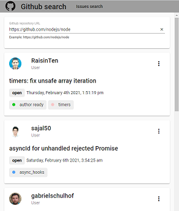

**Proyecto de pruebas para obtener los issues de un repositorio de Github**

Es necesario tener node/npm instalado y ejecutar **npm install** en el directorio raíz.

**npm run start** Para ejecutar el proyecto en tiempo real. http://localhost:4200

**npm run build** Para generar los ficheros de despliegue en la carpeta dist.

**npm run test** Para ejecutar los tests unitarios.

**npm run e2e** Para ejecutar los tests e2e, solo estan preparados para ser ejecutados contra el entorno de desarollo local (npm run start).
